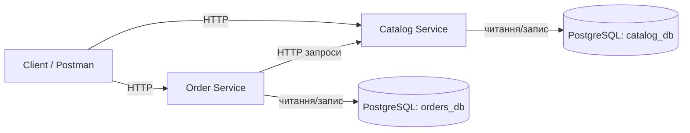
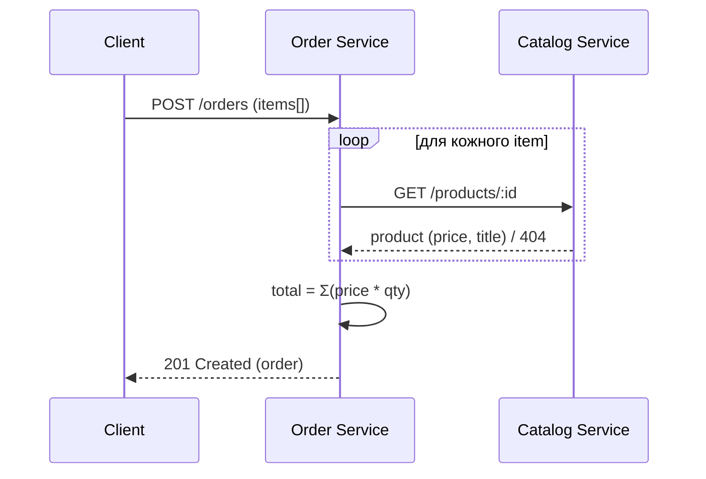

# Архітектура ShopLite

## Огляд

Проєкт побудовано як мінімальний набір мікросервісів:

- **Catalog Service** — джерело істини для товарів (створення/читання).
- **Order Service** — створення та читання замовлень; під час створення замовлення звертається до Catalog Service, щоб:
  - перевірити існування `productId`;
  - отримати ціну/дані для розрахунку підсумку.

## Межі відповідальності

### Catalog Service

- CRUD (у мінімумі для курсу — 3 роути): створення товару, список товарів, товар за id
- Валідація вхідних даних товару (наприклад: `price > 0`, `title` не порожній)

### Order Service

- Створення замовлення з переліком позицій
- Перевірка позицій через Catalog Service
- Розрахунок підсумку `total = Σ(price * qty)`
- Зберігання замовлень та їх позицій

## Компонентна діаграма (Mermaid)

## Взаємодія при створенні замовлення (послідовність)

## Нефункціональні вимоги (мінімум для курсу)

- Сервіси незалежні, мають власну БД (після ЛР4)
- Взаємодія між сервісами — через HTTP
- CI перевіряє форматування, лінтинг, білд, тести (ЛР6)
