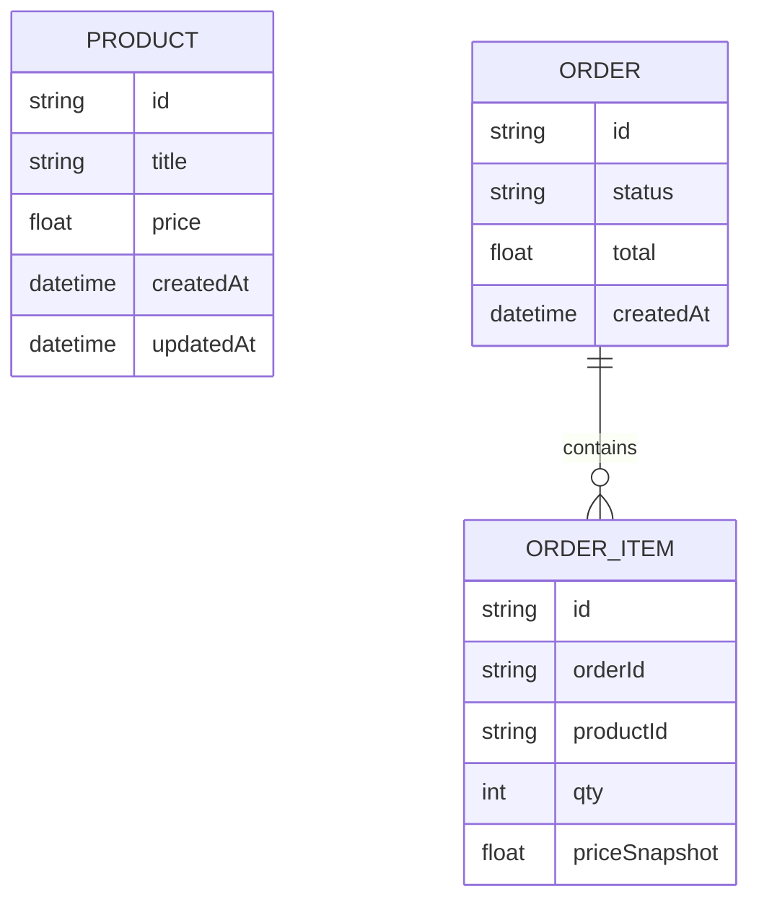

# Модель даних та ER-діаграма

## Сутності

### Product (Catalog Service)

- `id`: UUID/рядок
- `title`: назва
- `price`: число (>0)
- `createdAt`, `updatedAt`

### Order (Order Service)

- `id`: UUID/рядок
- `status`: наприклад `NEW | PAID | CANCELED` (можна почати з `NEW`)
- `total`: число (агреговане значення)
- `createdAt`

### OrderItem (Order Service)

- `id`: UUID/рядок
- `orderId`: FK на Order
- `productId`: id товару з Catalog Service
- `qty`: кількість (>0)
- `priceSnapshot`: ціна на момент створення (щоб не ламати історію при зміні ціни)

## ER-діаграма (Mermaid)

## Логіка оновлення/агрегації даних

- **Створення товару**: додає рядок у `PRODUCT`.
- **Створення замовлення**:
  1. Order Service отримує `items[]`.
  2. Для кожного `productId` виконує запит у Catalog Service.
  3. Формує `ORDER` і `ORDER_ITEM`, де `priceSnapshot` береться з відповіді Catalog Service.
  4. `total` обчислюється як сума `priceSnapshot * qty` по всіх позиціях.
- **Отримання замовлення**: читає `ORDER` + `ORDER_ITEM` та повертає разом.

## Обмеження (рекомендовано)

- `qty > 0`
- `priceSnapshot > 0`
- індекс по `ORDER_ITEM.orderId`
- у Catalog Service індекс/унікальність `PRODUCT.id`
